<h1 align="center"> Awesome-LLMs-in-Graph-tasks </a></h2>
<h5 align="center"> If you like our project, please give us a star ⭐ on GitHub for the latest update.</h5>

<h5 align="center">

 

</h5>

> This is a collection of papers on leveraging **Large Language Models** in **Graph Tasks**. 
It's based on our survey paper: [A Survey of Graph Meets Large Language Model: Progress and Future Directions](https://arxiv.org/abs/2311.12399). 

> We will try to make this list updated frequently. If you found any error or any missed paper, please don't hesitate to open issues or pull requests.

## How can LLMs help improve graph-related tasks?

With the help of LLMs, there has been a notable shift in the way we interact with graphs, particularly those containing nodes associated with text attributes. The integration of LLMs with traditional GNNs can be mutually beneficial and enhance graph learning. While GNNs are proficient at capturing structural information, they primarily rely on semantically constrained embeddings as node features, limiting their ability to express the full complexities of the nodes. Incorporating LLMs, GNNs can be enhanced with stronger node features that effectively capture both structural and contextual aspects. On the other hand, LLMs excel at encoding text but often struggle to capture structural information present in graph data. Combining GNNs with LLMs can leverage the robust textual understanding of LLMs while harnessing GNNs' ability to capture structural relationships, leading to more comprehensive and powerful graph learning.

<p align="center"></p>
<p align="center"><em>Figure 1.</em> The overview of Graph Meets LLMs.</p>


## Summarizations based on proposed taxonomy

<p align="center">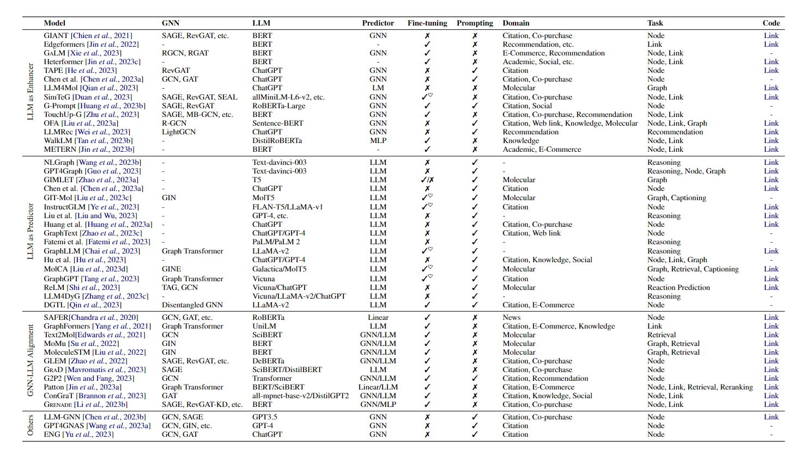</p>

<p align="left"><em>Table 1.</em> A summary of models that leverage LLMs to assist graph-related tasks in literature, ordered by their release time. <b>Fine-tuning</b> denotes whether it is necessary to fine-tune the parameters of LLMs, and &hearts; indicates that models employ parameter-efficient fine-tuning (PEFT) strategies, such as LoRA and prefix tuning. <b>Prompting</b> indicates the use of text-formatted prompts in LLMs, done manually or automatically. Acronyms in <b>Task</b>: Node refers to node-level tasks; Link refers to link-level tasks; Graph refers to graph-level tasks; Reasoning refers to Graph Reasoning; Retrieval refers to Graph-Text Retrieval; Captioning refers to Graph Captioning.</p >

## Table of Contents

- [Awesome-LLMs-in-Graph-tasks](#awesome-llms-in-graph-tasks)
  - [How can LLMs help improve graph-related tasks](#how-can-llms-help-improve-graph-related-tasks)
  - [Summarizations based on proposed taxonomy](#summarizations-based-on-proposed-taxonomy)
  - [Table of Contents](#table-of-contents)
  - [LLM as Enhancer](#llm-as-enhancer)
  - [LLM as Predictor](#llm-as-predictor)
  - [GNN-LLM Alignment](#gnn-llm-alignment)
  - [Others](#others)
  - [Contributing](#contributing)
  - [Cite Us](#cite-us)


## LLM as Enhancer
* (_2022.03_) [ICLR' 2022] **Node Feature Extraction by Self-Supervised Multi-scale Neighborhood Prediction** [[Paper](https://arxiv.org/abs/2111.00064) | [Code](https://github.com/amzn/pecos/tree/mainline/examples/giant-xrt)]
   <details close>
   <summary>GIANT</summary>
   <p align="center">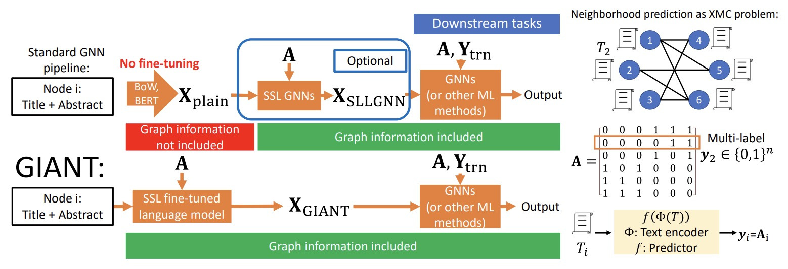</p>
   <p align="center"><em>The framework of GIANT.</em></p>
   </details>
* (_2023.02_) [ICLR' 2023] **Edgeformers: Graph-Empowered Transformers for Representation Learning on Textual-Edge Networks** [[Paper](https://arxiv.org/abs/2302.11050) | [Code](https://github.com/PeterGriffinJin/Edgeformers)]
   <details close>
   <summary>Edgeformers</summary>
   <p align="center">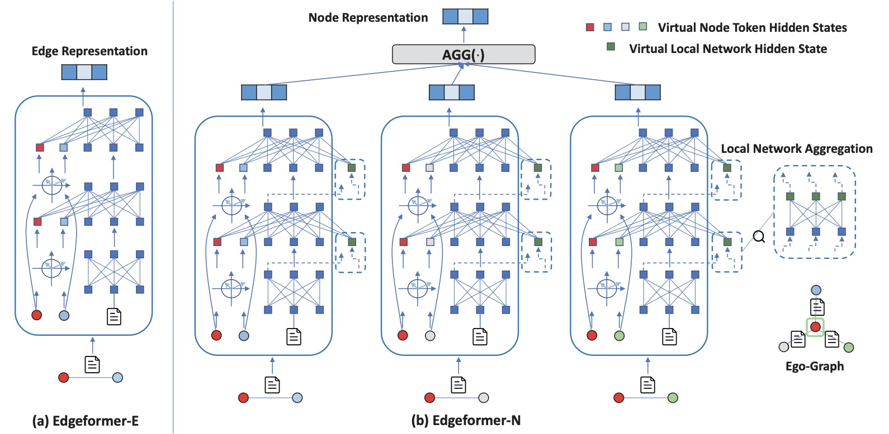</p>
   <p align="center"><em>The framework of Edgeformers.</em></p>
   </details>
* (_2023.05_) [KDD' 2023] **Graph-Aware Language Model Pre-Training on a Large Graph Corpus Can Help Multiple Graph Applications** [[Paper](https://arxiv.org/abs/2306.02592)]
   <details close>
   <summary>GALM</summary>
   <p align="center">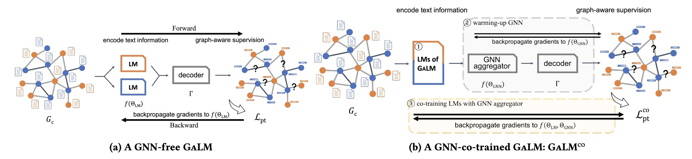</p>
   <p align="center"><em>The framework of GALM.</em></p>
   </details>
* (_2023.06_) [KDD' 2023] **Heterformer: Transformer-based Deep Node Representation Learning on Heterogeneous Text-Rich Networks** [[Paper](https://dl.acm.org/doi/abs/10.1145/3580305.3599376?casa_token=M9bG1HLyTEYAAAAA:gIiYO9atgtxNaBgfKpy4D3N66QDkCFLFvlEADvzC8Pobe_EWausOknGnRFzdDF-Xnq-vbWAWMT1qkA) | [Code](https://github.com/PeterGriffinJin/Heterformer)]
   <details close>
   <summary>Heterformer</summary>
   <p align="center">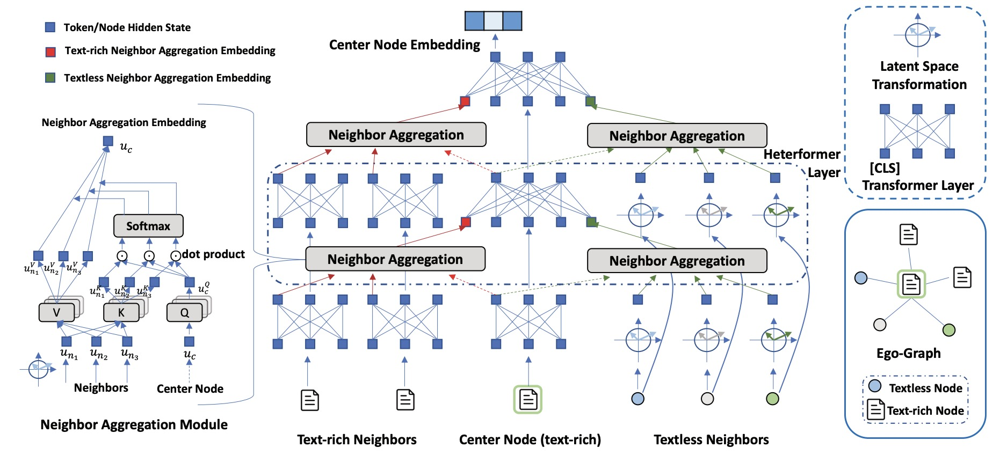</p>
   <p align="center"><em>The framework of Heterformer.</em></p>
   </details>
* (_2023.05_) [Arxiv' 2023] **Harnessing Explanations: LLM-to-LM Interpreter for Enhanced Text-Attributed Graph Representation Learning** [[Paper](https://arxiv.org/abs/2305.19523) | [Code](https://github.com/XiaoxinHe/TAPE)]
   <details close>
   <summary>TAPE</summary>
   <p align="center">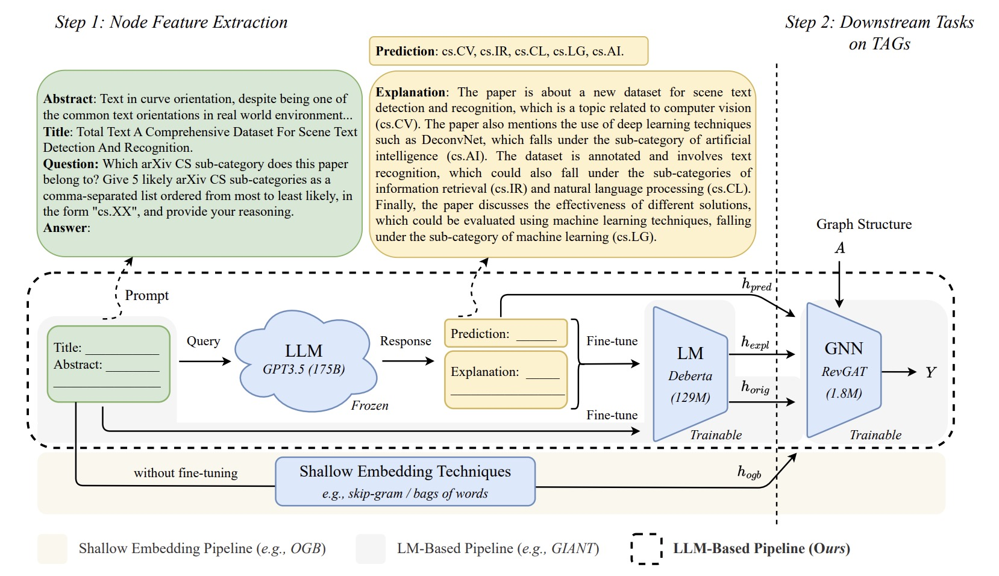</p>
   <p align="center"><em>The framework of TAPE.</em></p>
   </details>
* (_2023.08_) [Arxiv' 2023] **Exploring the potential of large language models (llms) in learning on graphs** [[Paper](https://arxiv.org/abs/2307.03393)]
   <details close>
   <summary>KEA</summary>
   <p align="center">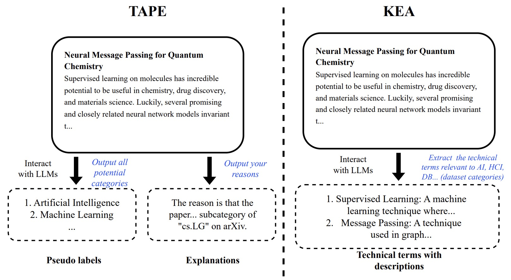</p>
   <p align="center"><em>The framework of KEA.</em></p>
   </details>
* (_2023.07_) [Arxiv' 2023] **Can Large Language Models Empower Molecular Property Prediction?** [[Paper](https://arxiv.org/abs/2307.07443) | [Code](https://github.com/ChnQ/LLM4Mol)]
   <details close>
   <summary>LLM4Mol</summary>
   <p align="center"></p>
   <p align="center"><em>The framework of LLM4Mol.</em></p>
   </details>
* (_2023.08_) [Arxiv' 2023] **Simteg: A frustratingly simple approach improves textual graph learning** [[Paper](https://arxiv.org/abs/2308.02565) | [Code](https://github.com/vermouthdky/SimTeG)]
   <details close>
   <summary>SimTeG</summary>
   <p align="center">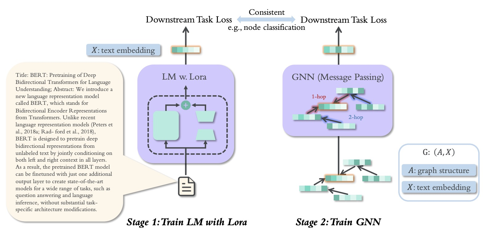</p>
   <p align="center"><em>The framework of SimTeG.</em></p>
   </details>
* (_2023.09_) [Arxiv' 2023] **Prompt-based Node Feature Extractor for Few-shot Learning on Text-Attributed Graphs** [[Paper](https://arxiv.org/abs/2309.02848)]
   <details close>
   <summary>G-Prompt</summary>
   <p align="center">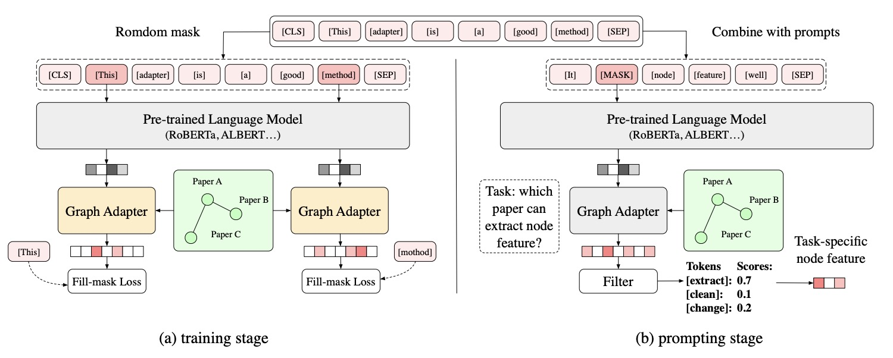</p>
   <p align="center"><em>The framework of G-Prompt.</em></p>
   </details>
* (_2023.09_) [Arxiv' 2023] **TouchUp-G: Improving Feature Representation through Graph-Centric Finetuning** [[Paper](https://arxiv.org/abs/2309.13885)]
   <details close>
   <summary>TouchUp-G</summary>
   <p align="center">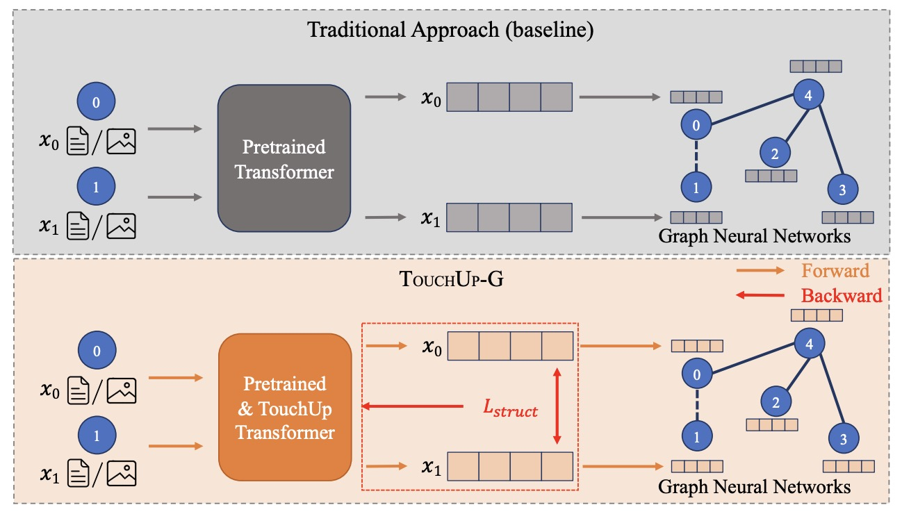</p>
   <p align="center"><em>The framework of TouchUp-G.</em></p>
   </details>
* (_2023.09_) [Arxiv' 2023] **One for All: Towards Training One Graph Model for All Classification Tasks** [[Paper](https://arxiv.org/abs/2310.00149) | [Code](https://github.com/LechengKong/OneForAll)]
   <details close>
   <summary>OFA</summary>
   <p align="center">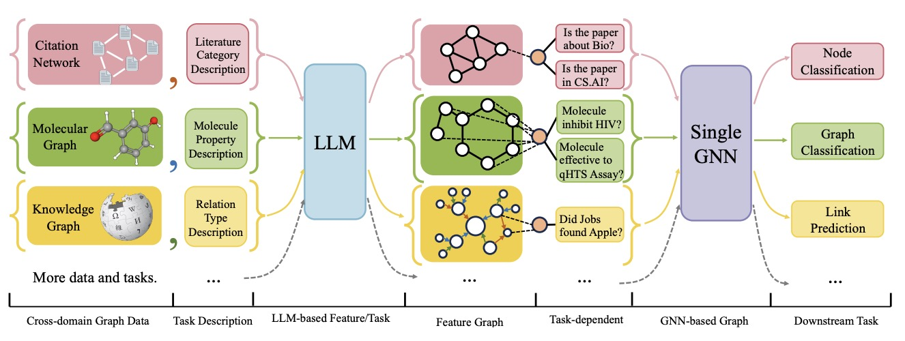</p>
   <p align="center"><em>The framework of OFA.</em></p>
   </details>
* (_2023.11_) [WSDM' 2024] **LLMRec: Large Language Models with Graph Augmentation for Recommendation** [[Paper](https://arxiv.org/abs/2311.00423) | [Code](https://github.com/HKUDS/LLMRec)]
   <details close>
   <summary>LLMRec</summary>
   <p align="center">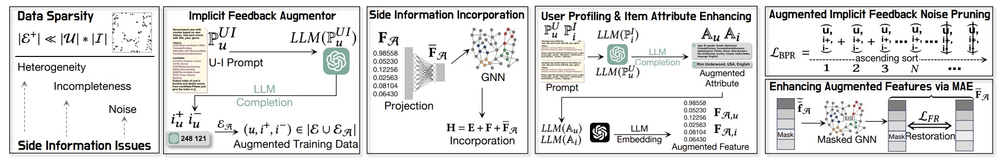</p>
   <p align="center"><em>The framework of LLMRec.</em></p>
   </details>
* (_2023.11_) [NeurIPS' 2023] **WalkLM: A Uniform Language Model Fine-tuning Framework for Attributed Graph Embedding** [[Paper](https://openreview.net/forum?id=ZrG8kTbt70) | [Code](https://github.com/Melinda315/WalkLM)]
   <details close>
   <summary>WalkLM</summary>
   <p align="center">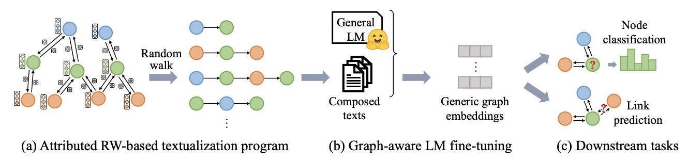</p>
   <p align="center"><em>The framework of WalkLM.</em></p>
   </details>
* (_2023.10_) [Arxiv' 2023] **Learning Multiplex Embeddings on Text-rich Networks with One Text Encoder** [[Paper](https://arxiv.org/abs/2310.06684) | [Code](https://github.com/PeterGriffinJin/METERN-submit)]
   <details close>
   <summary>METERN</summary>
   <p align="center">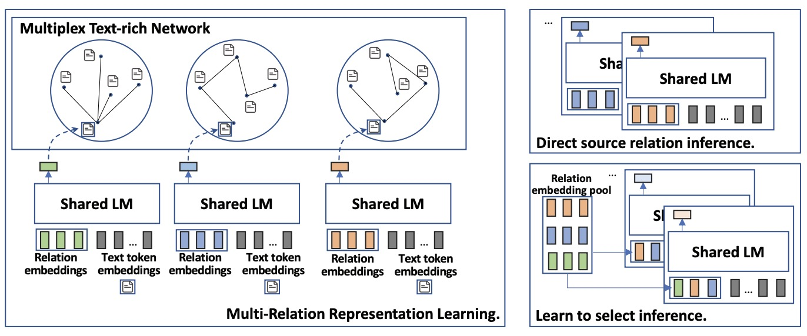</p>
   <p align="center"><em>The framework of METERN.</em></p>
   </details>

## LLM as Predictor

* (_2023.05_) [NeurIPS' 2023] **Can language models solve graph problems in natural language?** [[Paper](https://arxiv.org/abs/2305.10037) | [Code](https://github.com/Arthur-Heng/NLGraph)]
   <details close>
   <summary>NLGraph</summary>
   <p align="center">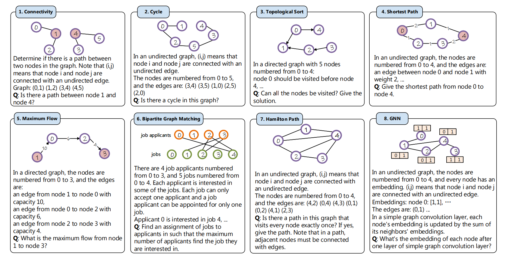</p>
   <p align="center"><em>The framework of NLGraph.</em></p>
   </details>
* (_2023.05_) [Arxiv' 2023] **GPT4Graph: Can Large Language Models Understand Graph Structured Data? An Empirical Evaluation and Benchmarking** [[Paper](https://arxiv.org/abs/2305.15066) | [Code](https://anonymous.4open.science/r/GPT4Graph)]
   <details close>
   <summary>GPT4Graph</summary>
   <p align="center">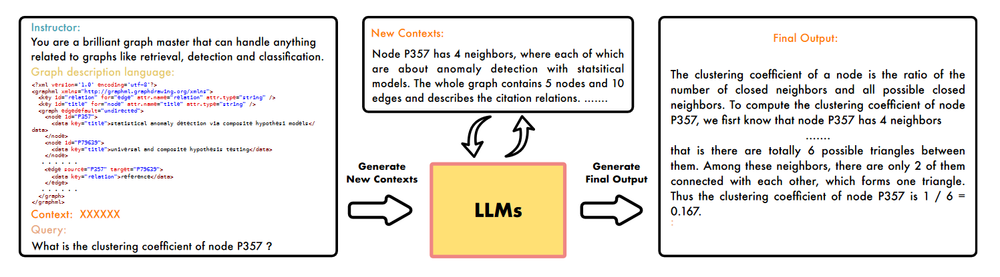</p>
   <p align="center"><em>The framework of GPT4Graph.</em></p>
   </details>
* (_2023.06_) [NeurIPS' 2023] **GIMLET: A Unified Graph-Text Model for Instruction-Based Molecule Zero-Shot Learning** [[Paper](https://arxiv.org/abs/2306.13089) | [Code](https://github.com/zhao-ht/GIMLET)]
   <details close>
   <summary>GIMLET</summary>
   <p align="center">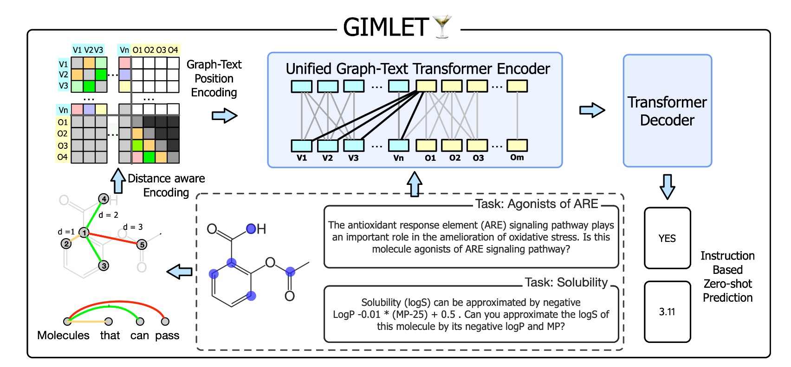</p>
   <p align="center"><em>The framework of GIMLET.</em></p>
   </details>
* (_2023.07_) [Arxiv' 2023] **Exploring the Potential of Large Language Models (LLMs) in Learning on Graphs** [[Paper](https://arxiv.org/abs/2307.03393) | [Code](https://github.com/CurryTang/Graph-LLM)]
   <details close>
   <summary>Framework</summary>
   <p align="center"></p>
   <p align="center"><em>The designed prompts of Chen et al.</em></p>
   </details>
* (_2023.08_) [Arxiv' 2023] **GIT-Mol: A Multi-modal Large Language Model for Molecular Science with Graph, Image, and Text** [[Paper](https://arxiv.org/abs/2308.06911)]
   <details close>
   <summary>GIT-Mol</summary>
   <p align="center">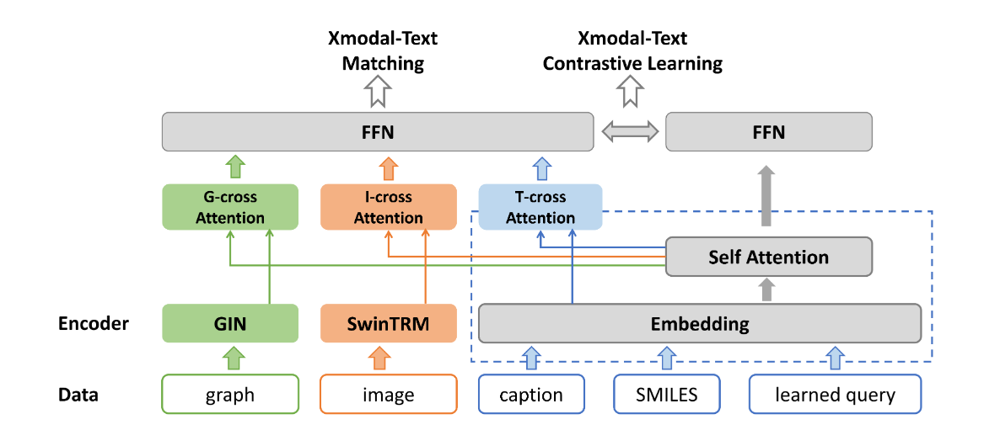</p>
   <p align="center"><em>The framework of GIT-Mol.</em></p>
   </details>
* (_2023.08_) [Arxiv' 2023] **Natural Language is All a Graph Needs** [[Paper](http://arxiv.org/abs/2308.07134) | [Code](https://github.com/agiresearch/InstructGLM)]
   <details close>
   <summary>InstructGLM</summary>
   <p align="center">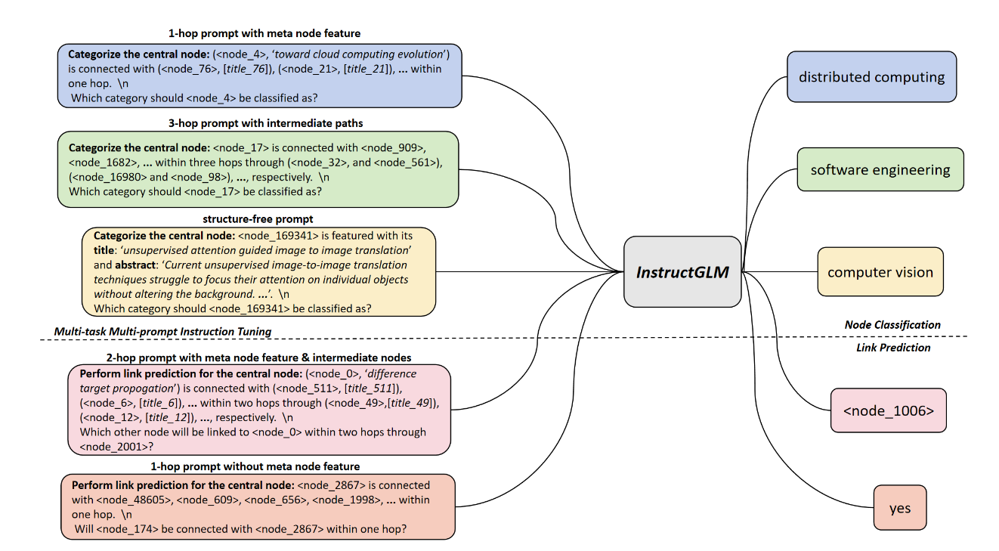</p>
   <p align="center"><em>The framework of InstructGLM.</em></p>
   </details>
* (_2023.08_) [Arxiv' 2023] **Evaluating Large Language Models on Graphs: Performance Insights and Comparative Analysis** [[Paper](https://arxiv.org/abs/2308.11224) | [Code](https://github.com/Ayame1006/LLMtoGraph)]
   <details close>
   <summary>Framework</summary>
   <p align="center"></p>
   <p align="center"><em>The designed prompts of Liu et al.</em></p>
   </details>
* (_2023.09_) [Arxiv' 2023] **Can LLMs Effectively Leverage Graph Structural Information: When and Why** [[Paper](https://arxiv.org/abs/2309.16595) | [Code](https://github.com/TRAIS-Lab/LLM-Structured-Data)]
   <details close>
   <summary>Framework</summary>
   <p align="center"></p>
   <p align="center"><em>The designed prompts of Huang et al.</em></p>
   </details>
* (_2023.10_) [Arxiv' 2023] **GraphText: Graph Reasoning in Text Space** [[Paper](https://arxiv.org/abs/2310.01089)]
   <details close>
   <summary>GraphText</summary>
   <p align="center">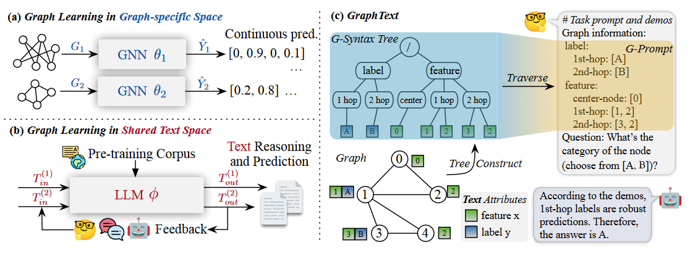</p>
   <p align="center"><em>The framework of GraphText.</em></p>
   </details>
* (_2023.10_) [Arxiv' 2023] **Talk like a Graph: Encoding Graphs for Large Language Models** [[Paper](https://arxiv.org/abs/2310.04560)]
   <details close>
   <summary>Framework</summary>
   <p align="center"></p>
   <p align="center"><em>The designed prompts of Fatemi et al.</em></p>
   </details>
* (_2023.10_) [Arxiv' 2023] **GraphLLM: Boosting Graph Reasoning Ability of Large Language Model** [[Paper](https://arxiv.org/abs/2310.05845) | [Code](https://github.com/mistyreed63849/Graph-LLM)]
   <details close>
   <summary>GraphLLM</summary>
   <p align="center">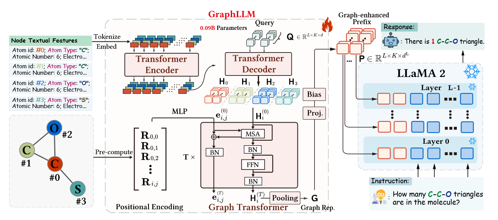</p>
   <p align="center"><em>The framework of GraphLLM.</em></p>
   </details>
* (_2023.10_) [Arxiv' 2023] **Beyond Text: A Deep Dive into Large Language Model** [[Paper](https://arxiv.org/abs/2310.04944)]
   <details close>
   <summary>Framework</summary>
   <p align="center"></p>
   <p align="center"><em>The designed prompts of Hu et al.</em></p>
   </details>
* (_2023.10_) [EMNLP' 2023] **MolCA: Molecular Graph-Language Modeling with Cross-Modal Projector and Uni-Modal Adapter** [[Paper](https://arxiv.org/abs/2310.12798) | [Code](https://github.com/acharkq/MolCA)]
   <details close>
   <summary>MolCA</summary>
   <p align="center">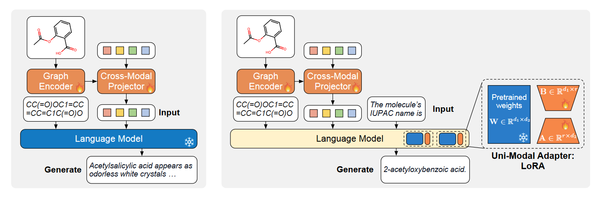</p>
   <p align="center"><em>The framework of MolCA.</em></p>
   </details>
* (_2023.10_) [Arxiv' 2023] **GraphGPT: Graph Instruction Tuning for Large Language Models** [[Paper](https://arxiv.org/abs/2310.13023v1) | [Code](https://github.com/HKUDS/GraphGPT)]
   <details close>
   <summary>GraphGPT</summary>
   <p align="center">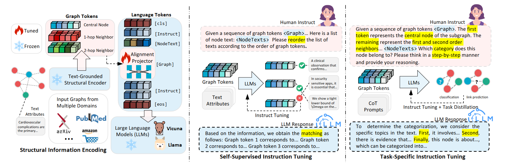</p>
   <p align="center"><em>The framework of GraphGPT.</em></p>
   </details>
* (_2023.10_) [EMNLP' 2023] **ReLM: Leveraging Language Models for Enhanced Chemical Reaction Prediction** [[Paper](https://arxiv.org/pdf/2310.13590.pdf) | [Code](https://github.com/syr-cn/ReLM)]
   <details close>
   <summary>ReLM</summary>
   <p align="center">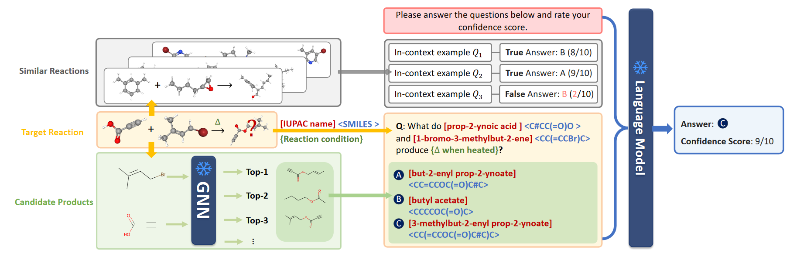</p>
   <p align="center"><em>The framework of ReLM.</em></p>
   </details>
* (_2023.10_) [Arxiv' 2023] **LLM4DyG: Can Large Language Models Solve Problems on Dynamic Graphs?** [[Paper](https://arxiv.org/pdf/2310.17110.pdf)]
   <details close>
   <summary>LLM4DyG</summary>
   <p align="center">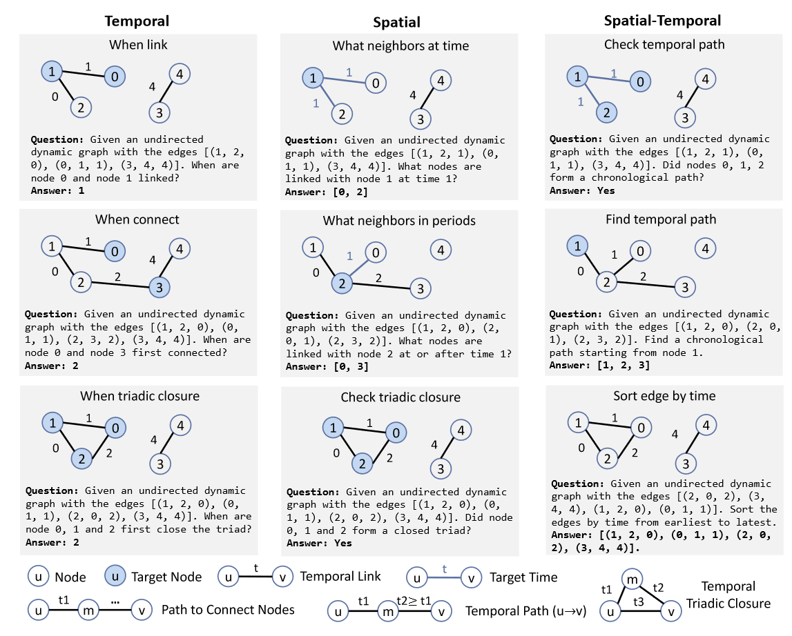</p>
   <p align="center"><em>The framework of LLM4DyG.</em></p>
   </details>
* (_2023.10_) [Arxiv' 2023] **Disentangled Representation Learning with Large Language Models for Text-Attributed Graphs** [[Paper](https://arxiv.org/abs/2310.18152)]
   <details close>
   <summary>DGTL</summary>
   <p align="center">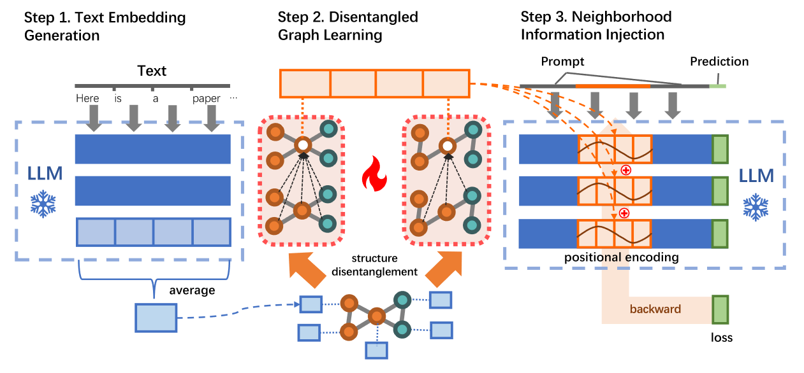</p>
   <p align="center"><em>The framework of DGTL.</em></p>
   </details>
* (_2023.11_) [Arxiv' 2023] **Which Modality should I use -- Text, Motif, or Image? : Understanding Graphs with Large Language Models** [[Paper](https://arxiv.org/abs/2311.09862)]
   <details close>
   <summary>Framework</summary>
   <p align="center"></p>
   <p align="center"><em>The framework of Das et al.</em></p>
   </details>

## GNN-LLM Alignment
* (_2020.08_) [Arxiv' 2020] **Graph-based Modeling of Online Communities for Fake News Detection** [[Paper](https://arxiv.org/abs/2008.06274) | [Code](https://github.com/shaanchandra/SAFER)]
   <details close>
   <summary>SAFER</summary>
   <p align="center">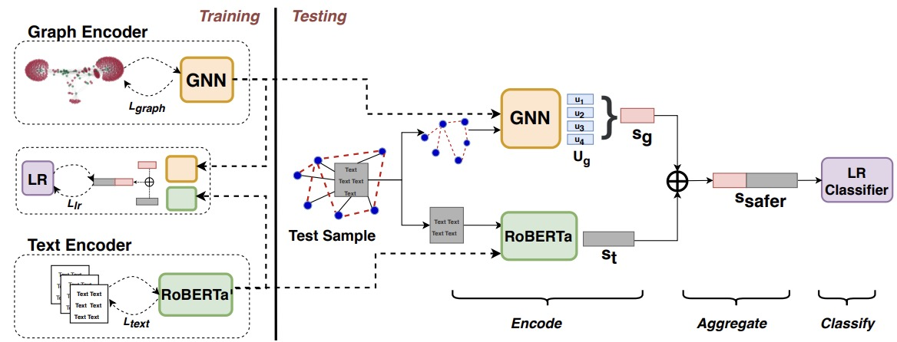</p>
   <p align="center"><em>The framework of SAFER.</em></p>
   </details>
* (_2021.05_) [NeurIPS' 2021] **GraphFormers: GNN-nested Transformers for Representation Learning on Textual Graph** [[Paper](https://arxiv.org/abs/2105.02605) | [Code](https://github.com/microsoft/GraphFormers)]
   <details close>
   <summary>GraphFormers</summary>
   <p align="center">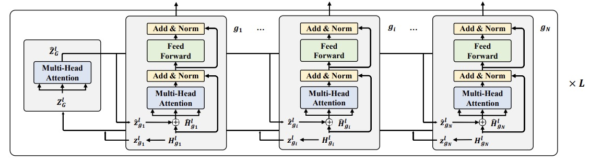</p>
   <p align="center"><em>The framework of GraphFormers.</em></p>
   </details>
* (_2021.11_) [EMNLP' 2021] **Text2Mol: Cross-Modal Molecule Retrieval with Natural Language Queries** 
[[Paper](https://aclanthology.org/2021.emnlp-main.47/) | [Code](https://github.com/cnedwards/text2mol)]
   <details close>
   <summary>Text2Mol</summary>
   <p align="center">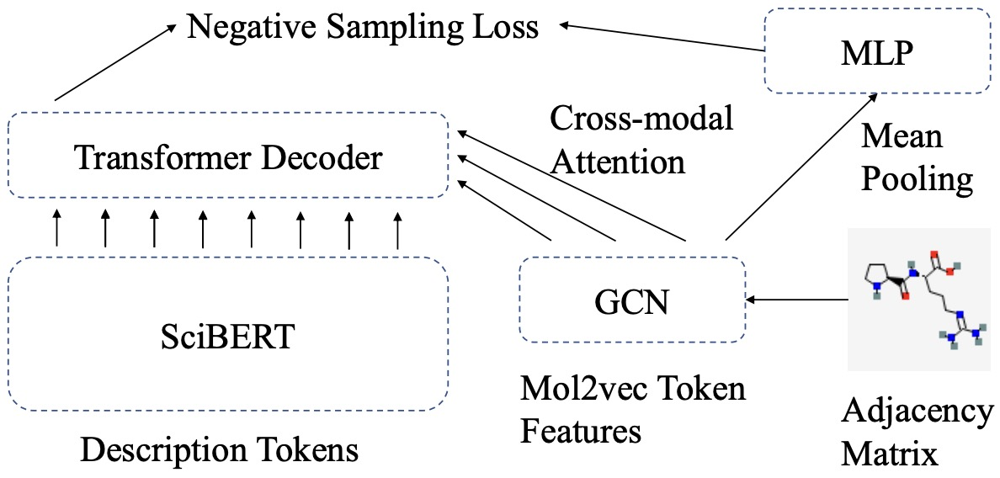</p>
   <p align="center"><em>The framework of Text2Mol.</em></p>
   </details>
* (_2022.09_) [Arxiv' 2022] **A Molecular Multimodal Foundation Model Associating Molecule Graphs with Natural Language** 
[[Paper](https://arxiv.org/abs/2209.05481) | [Code](https://github.com/BingSu12/MoMu)]
   <details close>
   <summary>MoMu</summary>
   <p align="center">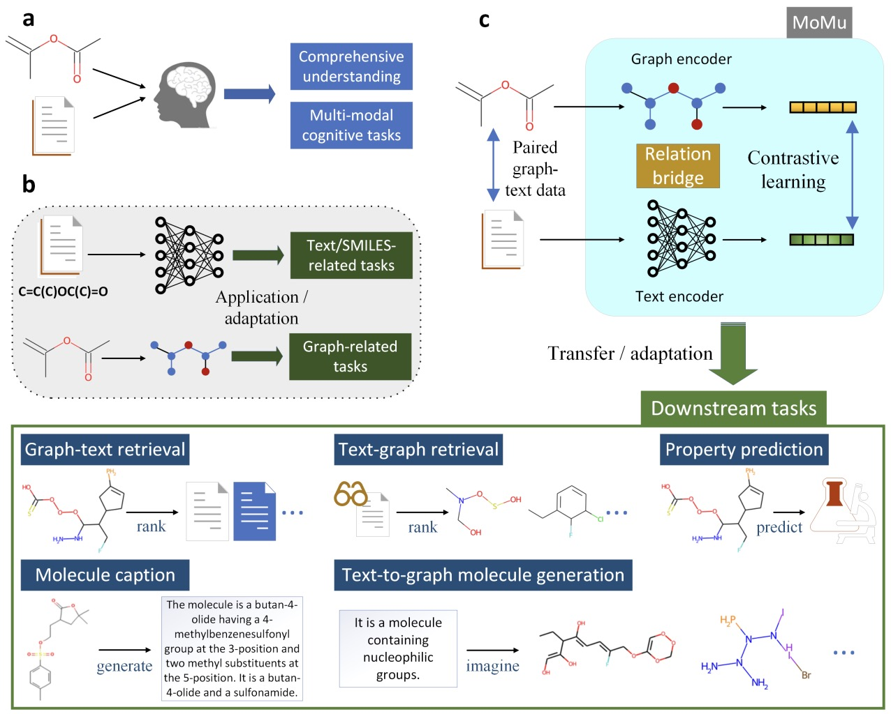</p>
   <p align="center"><em>The framework of MoMu.</em></p>
   </details>
* (_2022.10_) [ICLR' 2023] **Learning on Large-scale Text-attributed Graphs via Variational Inference** 
[[Paper](https://arxiv.org/abs/2210.14709) | [Code](https://github.com/AndyJZhao/GLEM)]
   <details close>
   <summary>GLEM</summary>
   <p align="center">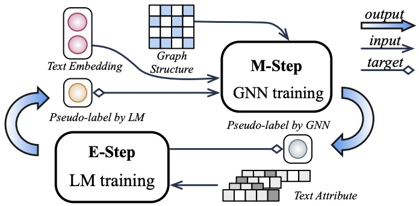</p>
   <p align="center"><em>The framework of GLEM.</em></p>
   </details>
* (_2022.12_) [NMI' 2023] **Multi-modal Molecule Structure-text Model for Text-based Editing and Retrieval** 
[[Paper](https://arxiv.org/abs/2212.10789) | [Code](https://github.com/chao1224/MoleculeSTM)]
   <details close>
   <summary>MoleculeSTM</summary>
   <p align="center">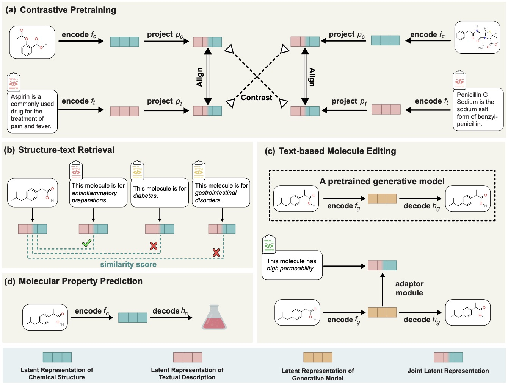</p>
   <p align="center"><em>The framework of MoleculeSTM.</em></p>
   </details>
* (_2023.04_) [Arxiv' 2023] **Train Your Own GNN Teacher: Graph-Aware Distillation on Textual Graphs** 
[[Paper](https://arxiv.org/abs/2304.10668) | [Code](https://github.com/cmavro/GRAD)]
   <details close>
   <summary>GRAD</summary>
   <p align="center">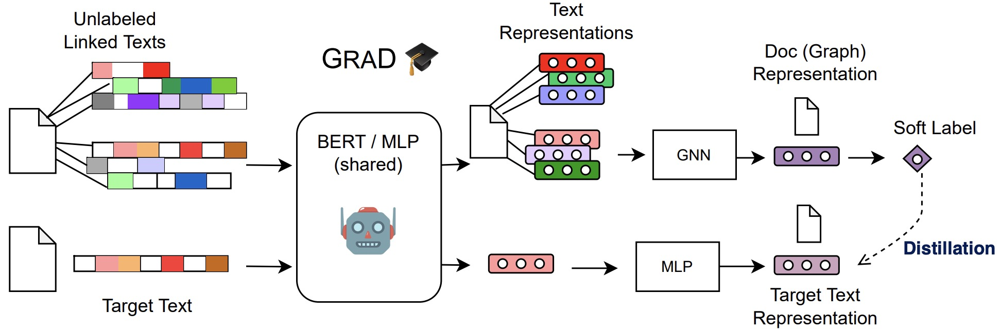</p>
   <p align="center"><em>The framework of GRAD.</em></p>
   </details>
* (_2023.05_) [ACL' 2023] **PATTON : Language Model Pretraining on Text-Rich Networks** 
[[Paper](https://arxiv.org/abs/2305.12268) | [Code](https://github.com/PeterGriffinJin/Patton)]
   <details close>
   <summary>Patton</summary>
   <p align="center"></p>
   <p align="center"><em>The framework of Patton.</em></p>
   </details>
* (_2023.05_) [Arxiv' 2023] **ConGraT: Self-Supervised Contrastive Pretraining for Joint Graph and Text Embeddings** 
[[Paper](https://arxiv.org/abs/2305.14321) | [Code](https://github.com/wwbrannon/congrat)]
   <details close>
   <summary>ConGraT</summary>
   <p align="center"></p>
   <p align="center"><em>The framework of ConGraT.</em></p>
   </details>
* (_2023.07_) [Arxiv' 2023] **Prompt Tuning on Graph-augmented Low-resource Text Classification** 
[[Paper](https://arxiv.org/abs/2307.10230) | [Code](https://github.com/WenZhihao666/G2P2-conditional)]
   <details close>
   <summary>G2P2</summary>
   <p align="center">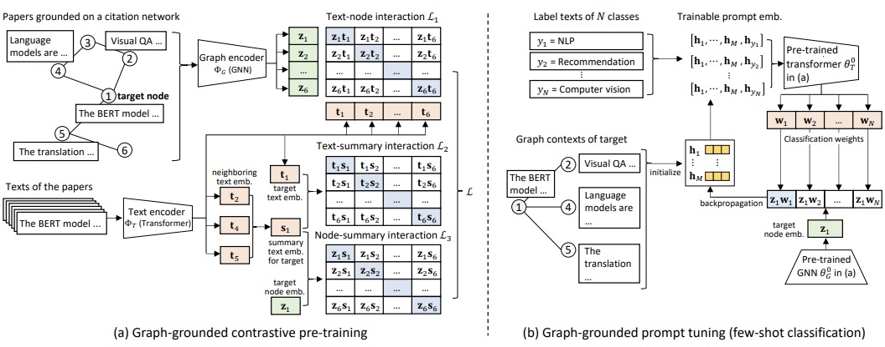</p>
   <p align="center"><em>The framework of G2P2.</em></p>
   </details>
* (_2023.10_) [Arxiv' 2023] **GRENADE: Graph-Centric Language Model for Self-Supervised Representation Learning on Text-Attributed Graphs** 
[[Paper](https://arxiv.org/abs/2310.15109) | [Code](https://github.com/bigheiniu/GRENADE)]
   <details close>
   <summary>GRENADE</summary>
   <p align="center">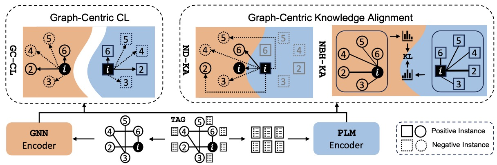</p>
   <p align="center"><em>The framework of GRENADE.</em></p>
   </details>
* (_2023.10_) [Arxiv' 2023] **Representation Learning with Large Language Models for Recommendation** 
[[Paper](https://arxiv.org/abs/2310.15950) | [Code](https://github.com/HKUDS/RLMRec)]
   <details close>
   <summary>RLMRec</summary>
   <p align="center">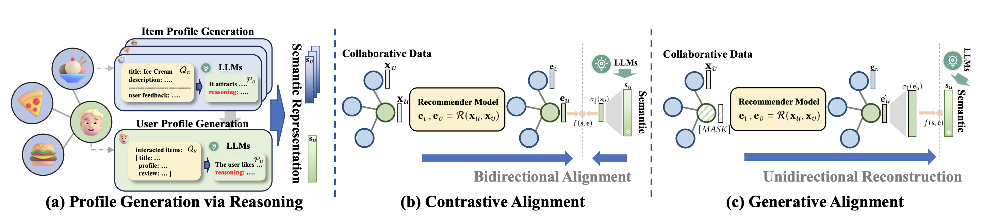</p>
   <p align="center"><em>The framework of RLMRec.</em></p>
   </details>

## Others

### LLM as Annotator

* (_2023.10_) [Arxiv' 2023] **Label-free Node Classification on Graphs with Large Language Models (LLMs)** [[Paper](https://arxiv.org/abs/2310.18152) | [Code](https://github.com/CurryTang/LLMGNN)]
   <details close>
   <summary>LLM-GNN</summary>
   <p align="center">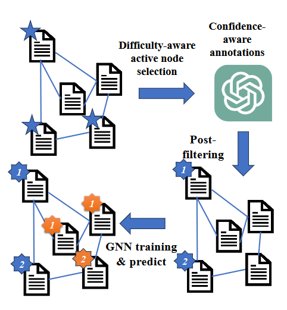</p>
   <p align="center"><em>The framework of LLM-GNN.</em></p>
   </details>

### LLM as Controller

* (_2023.10_) [Arxiv' 2023] **Graph Neural Architecture Search with GPT-4** [[Paper](https://arxiv.org/abs/2310.01436)]
   <details close>
   <summary>GPT4GNAS</summary>
   <p align="center">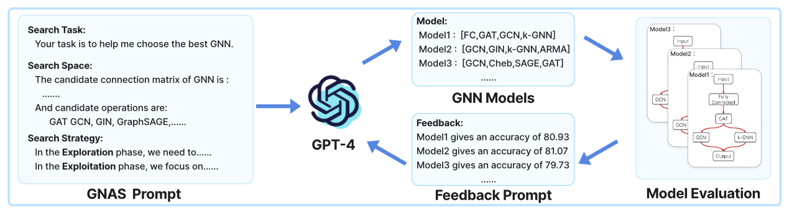</p>
   <p align="center"><em>The framework of GPT4GNAS.</em></p>
   </details>

### LLM as Sample Generator

* (_2023.10_) [Arxiv' 2023] **Empower Text-Attributed Graphs Learning with Large Language Models (LLMs)** [[Paper](https://arxiv.org/abs/2310.09872)]
   <details close>
   <summary>ENG</summary>
   <p align="center">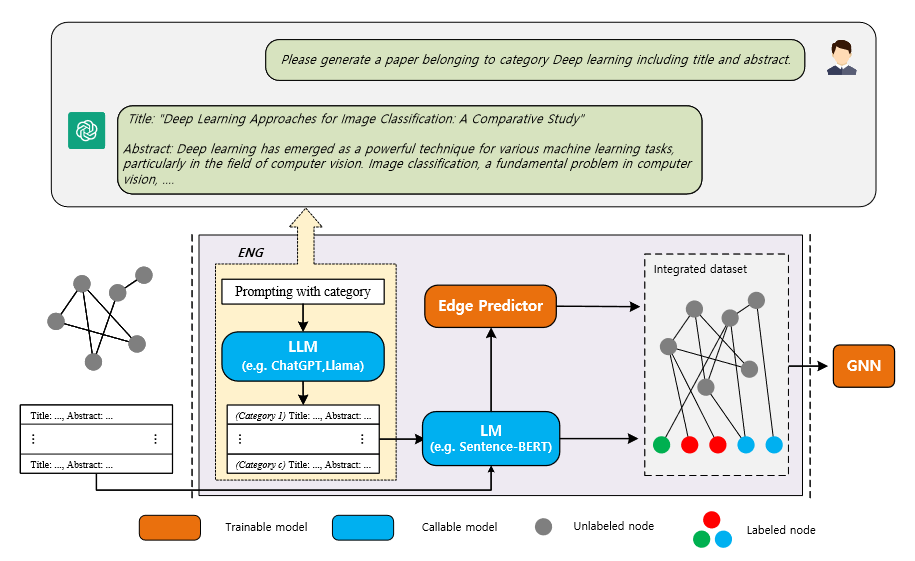</p>
   <p align="center"><em>The framework of ENG.</em></p>
   </details>

### LLM as Similarity Analyzer

* (_2023.11_) [Arxiv' 2023] **Large Language Models as Topological Structure Enhancers for Text-Attributed Graphs** [[Paper](https://arxiv.org/abs/2311.14324)]
   <details close>
   <summary>Framework</summary>
   <p align="center"></p>
   <p align="center"><em>The framework of Sun et al.</em></p>
   </details>

## Other Repos

We note that several repos also summarize papers on the integration of LLMs and graphs. However, we differentiate ourselves by organizing these papers leveraging a new and more granular taxonomy. We recommend researchers to explore some repositories for a comprehensive survey.

- [Awesome-Graph-LLM](https://github.com/XiaoxinHe/Awesome-Graph-LLM), created by [Xiaoxin He](https://xiaoxinhe.github.io/) from NUS.

- [Awesome-Large-Graph-Model](https://github.com/THUMNLab/awesome-large-graph-model), created by [Ziwei Zhang](https://zw-zhang.github.io/) from THU.

- [Awesome-Language-Model-on-Graphs](https://github.com/PeterGriffinJin/Awesome-Language-Model-on-Graphs), created by [Bowen Jin](https://peterjin.me/) from UIUC.

We highly recommend a repository that summarizes the work on **Graph Prompt**, which is very close to Graph-LLM.

- [Awesome-Graph-Prompt](https://github.com/WxxShirley/Awesome-Graph-Prompt), created by [Xixi Wu](https://wxxshirley.github.io/) from FDU.


## Contributing

If you have come across relevant resources, feel free to open an issue or submit a pull request.

```
* (_time_) [conference] **paper_name** [[Paper](link) | [Code](link)]
   <details close>
   <summary>Model name</summary>
   <p align="center"></p>
   <p align="center"><em>The framework of model name.</em></p>
   </details>
```

## Cite Us

Feel free to cite this work if you find it useful to you!
```
@article{li2023survey,
  title={A Survey of Graph Meets Large Language Model: Progress and Future Directions},
  author={Li, Yuhan and Li, Zhixun and Wang, Peisong and Li, Jia and Sun, Xiangguo and Cheng, Hong and Yu, Jeffrey Xu},
  journal={arXiv preprint arXiv:2311.12399},
  year={2023}
}
```
